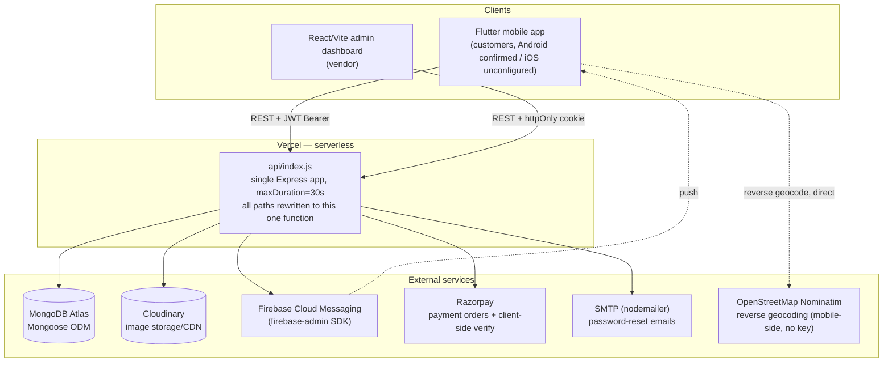
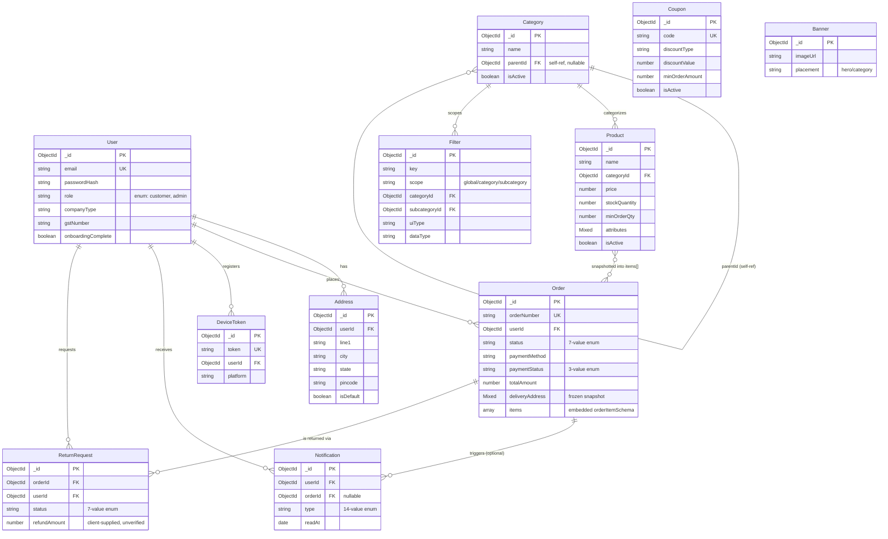

# B2B Ordering Platform — Technical Documentation & Audit Context

**Purpose of this document:** give a technical reviewer (human or AI) enough grounded, verified context to audit this application end-to-end — architecture, security, scalability, and implementation gaps — without needing to re-derive everything from the raw codebase.

**How this document was produced:** by direct inspection of the codebase at `C:\my prjs\b2b-ecommerce-flutter` on 2026-09-02 (backend `src/`, `mobile_app/lib/`, `admin_dashboard/src/`, `docs/`, config files, and one live reachability check against the deployed backend). It does **not** rely on the project's own prior planning documents except where explicitly cited and cross-checked against real code.

**Status legend:** ✅ Implemented · 🟡 Partially implemented · 🔴 Not implemented · ❓ Unknown / needs confirmation from the owner.

**A note on the repository's own documentation:** this repo contains three generations of planning docs that describe *different, mutually incompatible* architectures:
1. Root `README.md`, `docs/FLUTTER_SETUP.md`, and all five `docs/*.sql` files describe an **original Supabase/Postgres plan** that was abandoned. These are dead documentation.
2. `docs/MASTER_PROMPT.md` (dated 2026-07-23) is a prior audit describing the **post-migration MongoDB architecture** and is mostly accurate, but is now stale on at least two points confirmed during this audit: it claims push notifications are unimplemented (they are fully implemented) and that nothing is deployed (the backend is live).
3. `docs/FIREBASE_PUSH_SETUP.md` accurately documents the current, implemented FCM push system.

This document supersedes all of the above for architecture purposes. Recommend archiving or deleting the stale files (see [§29](#29-technical-debt)) so future contributors — human or AI — don't get misled.

---

## 1. Project Overview

| Field | Value |
|---|---|
| App name (product/brand) | ❓ UNKNOWN — no consistent brand name found. Android `applicationId`/`namespace` is `com.packaginghub`; Android display label (`AndroidManifest.xml`) is still the Flutter default `"b2b_store"`; Terms & Conditions screen lists support contact `support@b2bstore.in`; Flutter project name is `b2b_store`. These three names disagree — needs a single decision before launch. |
| Purpose | A single-vendor B2B product ordering platform: one vendor lists a product catalog, business customers browse/order, the vendor manages fulfillment via an admin dashboard. |
| Target users | Business customers (the `User` model has `companyType`, `businessRole`, `gstNumber`, `workEmail` fields — B2B-specific) and one vendor/admin operating the store. |
| Business model | ❓ UNKNOWN — not documented or inferable from code. No subscription, commission, or marketplace-fee logic exists anywhere in the backend. |
| Vendor operation model | **Single-vendor**, not a multi-vendor marketplace. The `User.role` enum is only `['customer', 'admin']` — there is no `Vendor` model, no per-product vendor/seller reference, and no multi-tenant scoping anywhere in the schema. This is architecturally closer to a single-store B2B storefront than a Hyperpure-style multi-vendor/multi-warehouse platform. |
| How customers use the platform | Sign up → complete onboarding (with a delivery address) → browse/search/filter the catalog → add to cart → checkout (delivery or pickup, online/COD/pay-at-store) → track order status → request returns. |
| What differs from a normal B2C app | B2B-flavored profile fields (company type, GST number, business role), minimum-order-quantity field on products, no consumer reviews/ratings system found, delivery vs. pickup fulfillment modes, a filter/attribute system built for catalog faceting rather than lifestyle merchandising. |
| Expected scale | ❓ UNKNOWN — not documented anywhere. `MASTER_PROMPT.md` frames this as "a small vendor" needing "free alternatives only," implying low initial scale, but no concrete target (users/orders/day) is stated anywhere in the repo. |
| Current number of vendors | 1 (architecturally fixed at 1 — see above; not a configurable count). |
| Expected number of customers | ❓ UNKNOWN. |
| Expected daily orders | ❓ UNKNOWN. |
| Expected concurrent users | ❓ UNKNOWN. |
| Expected growth | ❓ UNKNOWN. |

---

## 2. User Types & Roles

The system has exactly **two** roles, enforced by a single `User.role` enum field (`backend/src/models/User.js`): `customer` and `admin`. There is **no** Super Admin tier, **no** delivery/staff role, and **no** admin-role granularity (e.g. "orders-only admin" vs. "full admin") — every `admin` account has identical, unrestricted access to every admin endpoint.

### Permissions matrix

| Capability | Customer | Admin |
|---|---|---|
| Browse products/categories | ✅ | ✅ |
| Manage own cart | ✅ | — |
| Place an order | ✅ (own only) | — |
| View own orders | ✅ | ✅ (all orders) |
| Change an order's status | 🔴 Not possible for anyone via a customer-facing route | ✅ (unrestricted — any status to any status, no transition guard) |
| Cancel an order | 🔴 **No cancel endpoint exists for either role** | 🔴 (no dedicated cancel action; only the generic status PATCH, which can set `cancelled`) |
| Manage own addresses | ✅ CRUD | — |
| Request a return | ✅ (own orders; no eligibility check enforced) | — |
| Approve/reject a return | — | ✅ |
| Create/edit/delete products | — | ✅ |
| Create/edit/delete categories | — | ✅ |
| Create/edit/delete coupons | — | ✅ |
| Create/edit/delete banners | — | ✅ |
| Create/edit/delete filters (attribute system) | — | ✅ |
| View/delete customers | — | ✅ (hard delete, no cascade — see [§21](#21-business-logic)) |
| Upload/delete images | — | ✅ |
| View notifications inbox | ✅ (own) | ✅ (own, same as any user — no admin-specific broadcast/inbox) |

Two view-only GET endpoints (`GET /api/categories`, `GET /api/products`, `GET /api/filters`) accept an `all=true` query parameter that bypasses the customer-facing `isActive` filter, and **none of these three GET routes requires authentication** — so an unauthenticated caller can retrieve inactive/unpublished catalog data intended only for the admin UI. This is a real permission gap; see [§12](#12-security-audit-information).

There is no in-app **Vendor** role distinct from Admin (a single vendor's operations *are* the admin dashboard), no **Delivery/Staff** role for a courier or warehouse worker to update fulfillment status from a device, and no **Super Admin** role for managing multiple admins/permissions. For a Hyperpure-style platform, a Delivery/Staff role (or at minimum an audit trail of which admin made which change) is a notable gap — see [§32](#32-critical-missing-items).

---

## 3. Complete User Flows

### 3.1 Customer flow

```
Signup (email+password, ≥6 chars) 
  → Login (JWT access+refresh tokens, stored in flutter_secure_storage)
  → Onboarding (must have ≥1 saved Address to complete; sets onboardingComplete=true)
  → Home / Browse (paginated catalog, GridView infinite scroll, 24/page)
  → Search (350ms debounced) / Filter (category-scoped attribute filters) / Sort
  → Product detail
  → Add to cart (persisted to shared_preferences; MOQ is NOT enforced — see §21)
  → Checkout: choose delivery vs. pickup → choose/enter saved address (delivery only)
  → Choose payment: online (Razorpay: UPI/card/netbanking/wallet) / COD (delivery) / pay-at-store (pickup)
  → Order created server-side (POST /api/orders) — client-supplied pricing is trusted, not recomputed server-side
  → [online only] Razorpay checkout sheet → client-side verify call (POST /api/payments/razorpay/verify, HMAC-checked server-side)
  → Order confirmation screen
  → Order tracking: 5-second HTTP polling (GET order by id in a loop), NOT a live push-driven stream — push notifications are a separate, parallel channel that also updates the in-app inbox
  → Delivery / pickup (status changes are admin-only; customer has no "confirm receipt" action)
  → Order history (GET /api/orders/mine, unpaginated)
  → Reorder: ❓ UNKNOWN / not found in the mobile agent's screen inventory — no explicit "reorder" action was located
  → Notifications: push (FCM) + in-app inbox, see §10
```

**Documented/observed failure cases:**
- Signup: 409 if email already registered; weak validation (6-char password minimum only, server-side).
- Login: generic 401 on bad credentials (no user enumeration).
- Order creation: 400 if `delivery_method`/`payment_method`/`items` missing; 404 if `address_id` doesn't belong to the caller; 400 if a delivery order has no resolvable address.
- Payment: signature-mismatch verify calls simply don't update `paymentStatus`; `POST /razorpay/failed` explicitly can't downgrade an already-`paid` order.
- Network/API failures: `ApiClient` (Flutter) wraps `SocketException`/`TimeoutException`/JSON-parse errors into a typed `ApiException`; 20s client timeout.
- **Not found anywhere:** stock/availability check at order-creation time (no evidence the backend rejects an order for an out-of-stock or below-MOQ item — see [§21](#21-business-logic)), and no idempotency protection against a double-submitted order (see [§18](#18-error-handling)).

### 3.2 Vendor (Admin) flow

```
Login (email+password → httpOnly cookie, 7-day expiry, no refresh mechanism for admin — see §11)
  → Dashboard (tab-based SPA, no router — Inventory is the default landing tab)
  → Add/Edit products (AddProduct.jsx — dynamic attribute fields driven by the Filter system)
  → Inventory (list/search/filter products client-side; edit/delete, incl. Cloudinary image cleanup on delete)
  → Receive order (OrderManager.jsx polls GET /orders/admin/all every 30s; no push-to-admin notification channel exists — admin only ever finds out about a new order by polling)
  → Accept/reject/process order (generic status PATCH; no dedicated "accept" or "reject" action, no transition guard)
  → Update status (pending → processing → packed → out_for_delivery → delivered/picked_up/cancelled — any jump is technically allowed by the API)
  → Set ETA / mark delayed (drives eta_set / order_delayed push notifications)
  → Manage customers (view/delete; delete is a hard delete, no cascade)
  → Manage returns (approve/reject/mark received/refunded — no notification is sent to the customer on any return-status change)
  → Reports: 🔴 Not implemented (no analytics/reports UI or endpoint found beyond the Filter "coverage" diagnostic — see §22)
  → Notifications: admin has no distinct notification channel; nothing pushes new-order alerts to the vendor beyond the 30-second dashboard poll
```

### 3.3 Admin / Super Admin flow

There is no separate Super Admin tier — see [§2](#2-user-types--roles). Every function above is available to any account with `role: 'admin'`, with account provisioning done exclusively through the `npm run seed` script (`ADMIN_SEED_EMAIL`/`ADMIN_SEED_PASSWORD` env vars) — there is no in-product "invite another admin" flow, and the admin login screen has no forgot-password link (🟡 — the generic password-reset API endpoints would technically work for an admin account, since they carry no role restriction, but nothing in the admin UI is wired to them).

---

## 4. Application Architecture



### Vercel backend specifics

| Aspect | Detail |
|---|---|
| Deployment model | **Single serverless function** (`backend/api/index.js`) fronting the entire Express app. `vercel.json` rewrites every path (`/(.*)`) to that one function; Express does the actual internal routing. |
| Function timeout | `maxDuration: 30` seconds (`vercel.json`) — any request (e.g. a large upload, a slow Cloudinary/Razorpay call) exceeding 30s is killed. |
| Cold starts | Not mitigated beyond MongoDB connection caching (below). Each cold invocation pays Node startup + Mongoose connect (if not cached) + any external API latency. |
| DB connection handling | ✅ Deliberately serverless-aware: `backend/src/config/db.js` caches the Mongoose connection (and the in-flight connection *promise*, to prevent a cold-start stampede of parallel connect attempts) on `global._mongoose`, `maxPoolSize: 10`. This is a correct, non-naive pattern for Mongoose-on-serverless. |
| Cron / background jobs | 🔴 None found — no `vercel.json` `crons` block, no scheduled function anywhere in the repo. |
| Webhooks | 🔴 **No Razorpay webhook endpoint exists.** Payment confirmation is entirely client-driven (the app calls `/api/payments/razorpay/verify` after its own checkout sheet reports success) — see [§9](#9-payment-system). |
| Environment variables (confirmed read in code) | `MONGODB_URI`, `JWT_ACCESS_SECRET`, `JWT_REFRESH_SECRET`, `JWT_ACCESS_EXPIRES_IN`, `JWT_REFRESH_EXPIRES_IN`, `CLOUDINARY_CLOUD_NAME`, `CLOUDINARY_API_KEY`, `CLOUDINARY_API_SECRET`, `RAZORPAY_KEY_ID`, `RAZORPAY_KEY_SECRET`, `FIREBASE_SERVICE_ACCOUNT` (or `FIREBASE_PROJECT_ID`/`FIREBASE_CLIENT_EMAIL`/`FIREBASE_PRIVATE_KEY`), `APP_TIMEZONE`, `APP_CURRENCY`, `SMTP_HOST`, `SMTP_PORT`, `SMTP_SECURE`, `SMTP_USER`, `SMTP_PASS`, `SMTP_FROM`, `PORT`, `CORS_ORIGIN`, `ADMIN_SEED_EMAIL`, `ADMIN_SEED_PASSWORD` — plus three platform-injected vars used for serverless detection (`NODE_ENV`, `VERCEL`, `AWS_LAMBDA_FUNCTION_NAME`/`FUNCTIONS_WORKER_RUNTIME`) that aren't meant to be manually set. All secret values were kept out of this document; none were read from the live `.env` file. |
| External API calls | Razorpay Orders API (direct `fetch`, server-side secret), Cloudinary Admin/Upload API, Firebase Admin SDK (FCM), SMTP via nodemailer. |
| Live status | ✅ **Confirmed deployed and reachable** — `https://packaginghub-six.vercel.app/health` returned HTTP 200 during this audit (2026-09-02). This directly contradicts `docs/MASTER_PROMPT.md`'s "nothing is deployed anywhere" claim, which is stale. The mobile app's local (gitignored, uncommitted) `.env` points `API_BASE_URL` at this same URL. |
| Limitations/risks of this architecture | 30s hard timeout per request; no queue for slow/bursty work (e.g. bulk notification fan-out relies on FCM's own multicast batching, not a job queue); a single function means no per-route scaling/isolation; no cron means no scheduled reconciliation job (e.g. for stuck `pending` payments — see §9) is possible without adding one. |

**Admin dashboard deployment:** `admin_dashboard/.vercel/project.json` shows a linked Vercel project (`admin_dashboard`), but no `admin_dashboard/vercel.json` exists, and the dashboard's local `.env` still points `VITE_API_BASE_URL` at `http://localhost:4000/api`. ❓ Whether the admin dashboard is actually deployed and, if so, what backend URL its *production* environment variables point to, is **unconfirmed** — this should be verified directly in the Vercel dashboard, not assumed from local files.

---

## 5. Technology Stack

| Technology | Version | Purpose | Where used | Status |
|---|---|---|---|---|
| Flutter | SDK constraint `>=3.11.0 <4.0.0` | Mobile app framework | `mobile_app/` | ✅ |
| Dart | (bundled with Flutter) | Language | `mobile_app/` | ✅ |
| Riverpod (`flutter_riverpod`) | `^3.3.1` | State management (primary, newer code) | auth/filter providers | ✅ |
| Provider | `^6.1.5+1` | State management (legacy, still in use alongside Riverpod) | `CartController`, `FilterProvider` via `MultiProvider` | 🟡 (two state-management libraries coexist) |
| `http` package | `^1.2.2` | HTTP client | `ApiClient` | ✅ (no `dio`) |
| `flutter_secure_storage` | `^10.3.1` | JWT token storage | `ApiClient` | ✅ |
| `shared_preferences` | `^2.3.4` | Cart persistence | `CartController` | ✅ |
| `firebase_core` / `firebase_messaging` | `^4.1.1` / `^16.0.2` | Push notifications | `push_notification_service.dart` | ✅ Android · 🔴 iOS (no `GoogleService-Info.plist`) |
| `flutter_local_notifications` | `^19.4.2` | Foreground notification display | same | ✅ |
| `go_router` | `^17.2.2` | Declared for navigation | — | 🔴 **Unused** — actual routing is a hand-written `onGenerateRoute` switch (`shop_ui/route/router.dart`); dead dependency |
| `geolocator` | `^14.0.2` | GPS location | `location_service.dart` | ✅ |
| `flutter_map` + `latlong2` | `^8.3.0` / `^0.9.1` | Map picker (OpenStreetMap-based) | `map_location_picker_screen.dart` | ✅ (not `google_maps_flutter` — that package is absent) |
| `razorpay_flutter` | `^1.4.4` | Payment checkout sheet | `payment_checkout_screen.dart` | ✅ Android/iOS · 🔴 has no web implementation (per `MASTER_PROMPT.md`, not independently re-verified this pass) |
| `flutter_launcher_icons` | `^0.14.4` | App icon generation | — | 🔴 **Declared but unconfigured** — no config block in `pubspec.yaml` |
| React | `^19.2.5` | Admin dashboard UI framework | `admin_dashboard/` | ✅ |
| Vite | `^8.0.10` | Admin dashboard build tool | `admin_dashboard/` | ✅ |
| Tailwind CSS | `^4.2.4` | Admin dashboard styling | `admin_dashboard/` | ✅ |
| `lucide-react` | `^1.14.0` | Icon set | `admin_dashboard/` | ✅ |
| React Router | — | — | — | 🔴 **Not used** — no routing library at all; single-page tab switch via local state |
| Charting library | — | — | — | 🔴 **Not used** — root `README.md`'s claim of "Charts and analytics" is inaccurate/aspirational |
| Node.js / Express | `^4.21.2` | Backend HTTP framework | `backend/` | ✅ |
| Mongoose | `^8.9.5` | MongoDB ODM | `backend/src/models` | ✅ |
| MongoDB Atlas | ❓ tier unconfirmed by this audit (M0 free tier per `MASTER_PROMPT.md`, not independently reverified) | Primary database | — | ✅ |
| `jsonwebtoken` | `^9.0.2` | JWT signing/verification | `src/utils/tokens.js` | ✅ |
| `bcryptjs` | `^2.4.3` | Password hashing (cost factor 10) | `routes/auth.js` | ✅ |
| `cloudinary` | `^2.5.1` | Image storage/CDN | `routes/upload.js` | ✅ |
| `firebase-admin` | `^14.2.0` | Server-side FCM push | `services/pushService.js` | ✅ |
| `nodemailer` | `^9.0.3` | Password-reset emails (SMTP) | `utils/mailer.js` | ✅ |
| `multer` | `^1.4.5-lts.1` | Multipart upload handling | `routes/upload.js` | ✅ (memory storage, 10MB cap, no MIME validation) |
| `cors` | `^2.8.5` | CORS middleware | `server.js` | ✅ |
| `cookie-parser` | `^1.4.7` | Cookie parsing (admin auth) | `server.js` | ✅ |
| `express-rate-limit` | — | — | — | 🔴 **Not installed** |
| `helmet` | — | — | — | 🔴 **Not installed** |
| `express-mongo-sanitize` | — | — | — | 🔴 **Not installed** |
| Any validation library (Joi/Zod/express-validator) | — | — | — | 🔴 **Not installed** — all validation is hand-written per route |
| Testing framework (Jest/Mocha/Vitest, backend or dashboard) | — | — | — | 🔴 **Not installed anywhere in the repo** |
| Analytics / logging / monitoring / error tracking (Sentry, etc.) | — | — | — | 🔴 **Not implemented** — `console.error`/`console.log` only |
| Search engine (Algolia/Elasticsearch/Meilisearch) | — | — | — | 🔴 Not used — search is a MongoDB regex `$or` query |
| Caching layer (Redis, etc.) | — | — | — | 🔴 Not used |
| Queue system | — | — | — | 🔴 Not used |
| SMS provider | — | — | — | 🔴 Not used anywhere (no Twilio/MSG91/etc.) |
| Maps (client) | OpenStreetMap via `flutter_map` + Nominatim (no key) | Location picker | mobile | ✅ (free, no Google Maps key) |

---

## 6. Database

MongoDB Atlas via Mongoose. 10 models total, one connection, no separate read replicas/sharding configured in code.

### Entity-relationship diagram



### Model detail

| Model | Purpose | Key fields (type, constraint) | Indexes | Notable rules |
|---|---|---|---|---|
| `User` | Account (customer or admin) | `email` (unique), `passwordHash`, `role` (enum customer/admin), B2B fields (`companyType`, `gstNumber`, `businessRole`, `workEmail`), legacy address mirror (`address`/`latitude`/`longitude`/`locationUrl`), password-reset fields (hashed code, expiry, attempts) | implicit unique on `email` | Legacy address fields are kept in sync with the user's default `Address` doc by `promoteToDefault()` — a denormalization that must be kept consistent by application code, not the DB. |
| `Address` | Delivery address (multiple per user) | `userId` (FK, indexed), `line1`/`city`/`state`/`pincode` required, `isDefault` | `{userId, isDefault, updatedAt}` compound | First address for a user is always forced `isDefault: true` server-side. |
| `Category` | Product category, one level of self-referential nesting | `parentId` (self-ref, not schema-enforced depth limit), `isActive`, `sortOrder` | none beyond `_id` | Deleting a category cascades to delete direct children (`deleteMany({parentId})`) but does **not** touch products under it — orphaned `categoryId` references remain. |
| `Product` | Catalog item | `price`, `discountedPrice`, `discountPercent`, `stockQuantity`, `minOrderQty` (default 1), `attributes` (Mixed, faceted), `isActive`, `isFeatured` | 5 indexes incl. a wildcard `attributes.$**` index; also a `text` index on name/brand/sku that **the actual search code does not use** (dead index — search uses a regex `$or` instead) | No tax/GST field anywhere on this model — see [§7](#7-product-system). |
| `Filter` | Dynamic attribute/facet definition for the catalog UI | `scope` (global/category/subcategory), `uiType` (6 types), `dataType` (3 types), `options` | unique compound on `{key, scope, categoryId, subcategoryId}` | Drives both the mobile filter sheet and the admin Filter Manager. |
| `Order` | Customer order | `orderNumber` (unique, app-generated `ORD-YYYYMMDD-<epoch ms>`, not a DB sequence), `status` (7-value enum), `paymentStatus` (3-value enum, independent of `status`), `items` (embedded snapshot array), `deliveryAddress` (Mixed, frozen snapshot — not a live `Address` reference) | `{userId, createdAt}` | **No index on `status`** despite `GET /api/orders/admin/all?status=` filtering on it — will degrate at scale. Pricing fields (`subtotal`, `discountAmount`, `deliveryCharge`, `totalAmount`) are populated from client-supplied values at creation with no server-side recomputation. |
| `ReturnRequest` | Return/refund request against an order | `status` (7-value enum), `returnMethod` (drop_off/pickup), `refundAmount` (client-supplied) | `{orderId}`, `{userId, createdAt}` | No check that the parent order is actually in a returnable status. |
| `Coupon` | Discount code | `code` (unique, uppercase), `discountType` (percent/flat), `discountValue`, `minOrderAmount`, `maxDiscountAmount` (optional) | implicit unique on `code` | **No expiry date field and no usage-count/usage-limit field** — a coupon can be reused indefinitely by anyone once created. |
| `Banner` | Homepage promotional banner | `placement` (hero/category) | `{placement, createdAt}` | No `isActive` flag — banners can't be soft-disabled, only deleted. |
| `DeviceToken` | FCM push token registration | `token` (unique — identity is the token, not the user), `userId`, `platform` | `{userId}` | Deliberately re-points a shared-device token to whichever user last logged in on it (documented design choice, not a bug). |
| `Notification` | In-app notification inbox row | `type` (14-value enum matching push types), `orderId` (nullable FK), `readAt` | `{userId, createdAt}` | Written *before* the push send attempt, so history survives failed/skipped deliveries. |

No model in the codebase uses Mongoose virtuals or pre/post save hooks — all cross-field consistency (e.g. address mirroring, notification dispatch) is handled explicitly in route/service code, not schema middleware.

---

## 7. Product System

| Capability | Status | Detail |
|---|---|---|
| Product creation/edit/delete | ✅ | Admin-only (`POST`/`PATCH`/`DELETE /api/products`), via `AddProduct.jsx` in the dashboard. Delete is a hard delete with no check for existing orders referencing the product (safe in practice, since order items are denormalized snapshots — but also no soft-delete/archive option). |
| Categories & subcategories | ✅ | One level of self-referential nesting via `Category.parentId`; no enforced depth limit beyond app convention. |
| Product images | ✅ | Stored on Cloudinary, uploaded via the backend proxy (`POST /api/upload`), 10MB cap, **no MIME-type validation**. |
| Pricing | ✅ | Single `price` + optional `discountedPrice`/`discountPercent` per product. |
| B2B / tiered / customer-specific pricing | 🔴 Not implemented | Every customer sees the same price for a product — no volume-tier pricing, no negotiated/contract pricing per customer or company. |
| Minimum order quantity (MOQ) | 🟡 Partially implemented | `Product.minOrderQty` exists on the model and is used for **display only** (per-unit pricing math, "X units" labels). The mobile cart (`CartController`) does **not** enforce it — a product with MOQ 10 can be added/incremented one unit at a time, and the backend order-creation route performs no MOQ check either. |
| Units (kg, box, piece, etc.) | ✅ | Free-text `Product.unit` field. |
| Stock / availability | 🟡 Partially implemented | `Product.stockQuantity` exists and is used as an "availability" filter condition (`stockQuantity > 0`) in catalog queries, but **no code path decrements stock on order placement**, and **no code path rejects an order for insufficient stock** — see [§21](#21-business-logic). |
| Out-of-stock handling | 🔴 Not implemented | No dedicated "sold out" order-blocking logic found; stock is advisory/display-only as currently wired. |
| Product variants (size/color/etc.) | 🔴 Not implemented | No variant sub-schema; `attributes` (Mixed) is used for faceted filtering, not purchasable variants with independent SKUs/stock. |
| Discounts | 🟡 | Flat `discountPercent`/`discountedPrice` per product; a "flash sale" view is just `discountPercent > 15` hardcoded in the products route — not a configurable campaign system. |
| GST / tax handling | 🔴 **Not implemented** | No tax/GST field exists anywhere on `Product` or `Order`. Users have a `gstNumber` profile field, but nothing in checkout computes or line-items a tax amount. For a B2B platform this is a notable gap if compliant invoicing is required. |
| Product search | ✅ | Regex `$or` across name/brand/sku (escaped to avoid ReDoS), case-insensitive. The model's `text` index is defined but unused by this code path. |
| Product filtering | ✅ | Rich, admin-configurable attribute/facet system (`Filter` model + `$facet` aggregation pipeline in `productQuery.js`) — this is one of the more sophisticated parts of the backend. |
| Product sorting | ✅ | Whitelisted sort options only (`newest`, `price_asc`, `price_desc`, `discount`, `name_asc`) — arbitrary sort injection is blocked. |

**Gaps for a B2B platform specifically:** no tiered/negotiated pricing, no GST/tax computation, no stock deduction/reservation, no product variants, no bulk-order-specific UI beyond MOQ display.

---

## 8. Order System

### Status lifecycle

`Order.status` enum (7 values): `pending` (default) → `processing` → `packed` → `out_for_delivery` → `delivered` | `picked_up` | `cancelled`.

`Order.paymentStatus` enum (3 values, **independent** of `status`): `pending` (default) → `paid` | `failed`.

| Status | Who can set it | Trigger | DB effect | Notification sent | Payment status change? | Inventory change? |
|---|---|---|---|---|---|---|
| `pending` | System (order creation) | Customer submits checkout | New `Order` doc created | `order_placed` (or `payment_pending` if prepaid & unpaid) | Defaults to `pending` | 🔴 None |
| `processing` | Admin only (generic PATCH) | Vendor accepts the order | `status` field updated | `order_accepted` | Not automatic | 🔴 None |
| `packed` | Admin only | Vendor finishes packing | `status` updated | `order_packed` (delivery) or `order_ready_for_pickup` (pickup) | Not automatic | 🔴 None |
| `out_for_delivery` | Admin only | Vendor dispatches | `status` updated | `out_for_delivery` (with ETA if set) | Not automatic | 🔴 None |
| `delivered` | Admin only | Vendor marks delivered | `status` updated | `order_delivered` | Not automatic | 🔴 None |
| `picked_up` | Admin only | Vendor marks picked up | `status` updated | `order_picked_up` | Not automatic | 🔴 None |
| `cancelled` | Admin only | Vendor cancels | `status` updated | `order_cancelled` (mentions refund if `paymentStatus==='paid'`) | Not automatic (a refund is *mentioned* in the message text but no refund is actually processed anywhere in code — see §9) | 🔴 None |

**Critical gap — no transition guard:** every status change goes through one generic `PATCH /api/orders/:id` (admin-only) that applies the request body directly via `findByIdAndUpdate` with **no state-machine validation**. An admin request can move a `delivered` order back to `pending`, or jump straight from `pending` to `cancelled`/`delivered`, and the API accepts it — only enum membership is enforced, not sequencing.

**Customer-side order control:** customers have **no** endpoint to cancel, modify, or otherwise change the status of their own order. The only customer-driven state change is payment status, via the Razorpay verify/fail routes (scoped to their own order).

### Race conditions / duplicate-order risk

- **No idempotency key on order creation.** `POST /api/orders` has no client-supplied idempotency token and no dedupe check (e.g. same user + same cart hash within N seconds) — a double-tap on "Place Order" or a client retry after a timed-out-but-succeeded request can create two orders. Not verified whether the Flutter UI disables the button after first tap (not confirmed by the mobile agent's report — mark ❓).
- **`orderNumber` uniqueness** relies on `ORD-YYYYMMDD-<Date.now()>` plus the schema's `unique: true` constraint — collision is astronomically unlikely but would surface as an unhandled 500 (duplicate-key error), not a friendly retry.
- **No stock reservation.** Because inventory is never decremented or checked, there is no oversell race condition *in the sense of two customers competing for the last unit* — but there's also no mechanism preventing unlimited overselling of an actually-limited-stock item.
- **Notification double-fire is explicitly guarded**: the order PATCH handler diffs previous vs. new values before deciding what to notify, and if both `status` and `paymentStatus` change in one PATCH, only the status notification fires (documented, deliberate suppression) — this part is well thought out.

---

## 9. Payment System

| Aspect | Status | Detail |
|---|---|---|
| Payment provider | ✅ Razorpay (test-mode key confirmed in mobile `.env`: `rzp_test_...`) |
| Payment methods | ✅ Online (Razorpay: UPI/card/netbanking/wallet), COD (delivery orders), pay-at-store (pickup orders) |
| Order creation on Razorpay | ✅ Server-side (`POST /api/payments/razorpay/create-order`), correct pattern — secret key never leaves the server, amount converted to paise server-side |
| Payment verification | ✅ **Server-side signature verification.** `POST /api/payments/razorpay/verify` independently recomputes `HMAC-SHA256(order_id|payment_id, keySecret)` and compares to the client-supplied signature — this is the correct approach (not trusting a bare "success" flag from the client). |
| Comparison method | 🟡 Uses plain `!==` string comparison rather than `crypto.timingSafeEqual` — a low-severity timing side-channel, not a functional bug. |
| Webhook verification | 🔴 **Not implemented.** No `/webhook` route, no `X-Razorpay-Signature` handling anywhere. Payment confirmation is **100% client-driven** — the app itself calls `/verify` after its local Razorpay SDK reports success. |
| Reconciliation for missed confirmations | 🔴 Not implemented. If the app crashes or loses network after Razorpay captures payment but before `/verify` is called, the order is permanently stuck at `paymentStatus: 'pending'`/`'failed'` with **no server-side job to detect and correct this** — money can be captured by Razorpay with no matching paid order in the system. This is the single most important payment-system gap. |
| Failed payment flow | ✅ `POST /razorpay/failed`, guarded so an already-`paid` order can't be downgraded. |
| Refunds | 🔴 **Not implemented at all.** No refund API call to Razorpay anywhere in the codebase. The `cancelled`-order push notification *text* mentions a refund ("...if already paid") but no actual refund is issued — this is a customer-facing promise the system cannot currently keep. |
| Partial refunds | 🔴 Not implemented (see above). |
| Payment status | ✅ Tracked (`pending`/`paid`/`failed`), but **entirely decoupled** from order `status` — a successful payment does not automatically advance order status, and vice versa; an admin must separately update `status`. |
| Order/payment synchronization | 🟡 Manual/admin-driven only, no automatic sync, no webhook-based ground truth (see above). |
| COD / pay-at-store | ✅ Bypasses Razorpay entirely; `paymentStatus` stays at its default (`pending`) until an admin manually edits it — there is no dedicated "mark COD order as paid" action, just the generic order PATCH. |

**Overall payment security assessment:** the *verification math* is done correctly and server-side (this is the part most apps get wrong, and this app gets it right). The *architectural* gap is the complete absence of a webhook, which means the system has no source of truth independent of what the client chooses to report — acceptable for a low-stakes prototype, not acceptable once real money is flowing at any meaningful volume.

---

## 10. Notification System

**FCM is fully implemented end-to-end on Android**, contradicting `docs/MASTER_PROMPT.md`'s stale claim that push notifications are missing — `docs/FIREBASE_PUSH_SETUP.md` is the accurate, current description, corroborated directly by the code (`backend/src/services/pushService.js`, `backend/src/services/orderNotifications.js`, `mobile_app/lib/core/services/push_notification_service.dart`).

### Architecture

```
routes/orders.js, routes/payments.js
        │  (fire-and-forget via services/dispatch.js — awaited only on serverless,
        │   so it can't be reclaimed mid-send, but never blocks/fails the HTTP response)
        ▼
services/orderNotifications.js   — decides message copy per event
        ▼
services/pushService.js
        │
        ├──▶ Notification (Mongo)  — in-app inbox row, written BEFORE the send attempt
        │
        └──▶ FCM sendEachForMulticast()  — one call fans out to every DeviceToken for the user
                    │
                    └──▶ dead tokens (3 specific FCM error codes) auto-pruned from DeviceToken
```

### Token lifecycle

| Question | Answer |
|---|---|
| How are tokens generated? | `FirebaseMessaging.instance.getToken()` on the client, after requesting notification permission. |
| Where stored? | `DeviceToken` collection in MongoDB — **keyed by token itself** (unique), not by user+token. |
| Multiple devices per user? | ✅ Yes — every `DeviceToken` row for a user receives the push via one multicast call. |
| Token refresh? | ✅ `FirebaseMessaging.instance.onTokenRefresh` listener re-registers automatically. |
| Token invalidation? | ✅ Automatic — dead-token FCM error codes (`registration-token-not-registered`, `invalid-registration-token`, `invalid-argument`) trigger a batch delete. Also explicit: `DELETE /api/devices` is called on logout. |
| Shared-device behavior | Deliberate design choice: a token is reassigned to whichever user last registered it (re-login on a shared device stops pushing to the previous user). |

### Backend send logic (Firebase Admin SDK)

- Uses the modular `firebase-admin/app` + `firebase-admin/messaging` API (v13+ style), not the older namespaced API.
- Gracefully degrades to a no-op if no Firebase credentials are configured (`getFirebaseApp()` returns `null`, logged once) — the app keeps functioning fully with push disabled.
- Android payload: `priority: 'high'`, `channelId: order_updates`, `tag: order_id` (collapses repeat notifications for the same order in the notification shade).
- iOS/APNs payload: badge count (computed live from unread `Notification` count), `content-available: 1`, `thread-id: order_id`. **Untested in practice** since iOS Firebase config (`GoogleService-Info.plist`) is absent from this checkout.

### Client behavior (`push_notification_service.dart`)

| State | Behavior |
|---|---|
| Foreground | `FirebaseMessaging.onMessage` → local notification shown via `flutter_local_notifications` on channel `order_updates`. |
| Background | Top-level background handler (`@pragma('vm:entry-point')`) registered via `onBackgroundMessage`. |
| App-open (tap) | `onMessageOpenedApp` routes to `order_details_screen` if payload has `route: 'order_details'` + `order_id`, else to the notifications inbox. |
| Cold start | `getInitialMessage()` on launch, same routing logic. |
| Android | Notification channel `order_updates` must match across three files (`pushService.js`, `push_notification_service.dart`, `AndroidManifest.xml`) — documented as a known footgun (Android silently drops notifications for an unrecognized channel id). |
| iOS | 🔴 **Not configured** — no `GoogleService-Info.plist` present; push cannot currently work on iOS builds from this checkout. |
| Permission | Requested post-login/signup/session-restore (not eagerly at launch); `POST_NOTIFICATIONS` declared in the Android manifest for Android 13+. |
| Deep links (OS-level) | 🔴 None — `go_router` is a dead dependency; only in-app navigation from a push payload exists, not an OS URI scheme. |
| Notification history | ✅ In-app inbox (`GET /api/notifications`, bell icon on Home) — survives missed/failed pushes since the DB row is written before the send attempt. |

### Notification event table (all 14 implemented types)

| Event | Recipient | Trigger | Notification type |
|---|---|---|---|
| Order placed (COD/pay-at-store) | Customer | Order created, not prepaid | `order_placed` |
| Order created, prepaid, unpaid | Customer | Order created, payment pending | `payment_pending` |
| Razorpay payment verified | Customer | `/razorpay/verify` succeeds | `payment_success` |
| Razorpay payment failed | Customer | `/razorpay/failed` or verify mismatch | `payment_failed` |
| Vendor accepts order | Customer | Status → `processing` | `order_accepted` |
| Order packed (delivery) | Customer | Status → `packed`, `deliveryMethod=delivery` | `order_packed` |
| Order ready (pickup) | Customer | Status → `packed`, `deliveryMethod=pickup` | `order_ready_for_pickup` |
| ETA set | Customer | Admin sets `estimatedDeliveryTime` | `eta_set` |
| Delivery delayed | Customer | Admin sets `deliveryAddress.is_delayed=true` | `order_delayed` |
| Out for delivery | Customer | Status → `out_for_delivery` | `out_for_delivery` |
| Delivered | Customer | Status → `delivered` | `order_delivered` |
| Picked up | Customer | Status → `picked_up` | `order_picked_up` |
| Order cancelled | Customer | Status → `cancelled` | `order_cancelled` |
| Manual test | Customer | `scripts/testPush.js` | `general` |

**Missing notification scenarios (gaps):**
- 🔴 **No notification to the vendor/admin when a new order arrives** — the admin dashboard only finds out via 30-second polling of `GET /orders/admin/all`. For a small vendor who isn't staring at the dashboard, this is a significant operational gap.
- 🔴 **No notification on any return-status change** (`approved`/`rejected`/`refunded`/etc.) — `orderNotifications.js` has no return-related function at all.
- 🔴 No low-stock/out-of-stock alert to the vendor (consistent with stock tracking being advisory-only — see §7/§21).
- 🔴 No abandoned-cart reminder, no coupon-expiry reminder (consistent with coupons having no expiry field).

---

## 11. Authentication & Authorization

| Aspect | Detail |
|---|---|
| Login | ✅ Email + bcrypt-hashed password (cost factor 10), generic 401 on failure (no user enumeration). |
| Registration | ✅ Email + password (server-side minimum 6 characters only — see §12 for the weak-policy flag). |
| Password reset | ✅ 6-character CSPRNG code (ambiguous glyphs excluded), SHA-256-hashed at rest (never stored in plaintext), 15-minute expiry, 60-second resend cooldown, 5-attempt cap before lockout+429. Delivered via SMTP (nodemailer). Not a magic link — a code the user types in. |
| OTP | ✅ (the password-reset code doubles as this; no separate phone-OTP login flow exists). |
| Sessions | Stateless — no server-side session store. |
| JWT | ✅ Access token (`sub`, `role` claims, default 1h expiry, 7 days for the admin-cookie flow) + refresh token (`sub` only, 30-day expiry). |
| Refresh tokens | 🟡 Implemented for token renewal (`POST /auth/refresh`), but **fully stateless** — no DB-backed issued-token registry, no rotation, no revocation list. A leaked refresh token remains valid for its full 30-day life with no way to invalidate it server-side (no "logout everywhere"). |
| Firebase Auth | 🔴 Not used — this app uses a fully custom JWT system, not Firebase Authentication (Firebase is used only for FCM push, a separate concern). |
| Role-based access control | 🟡 Exactly two roles (`customer`/`admin`); admin routes gated by chaining `requireAuth, requireAdmin` middleware per-route — functionally correct but coarse-grained (no permission scopes within "admin"). |
| Middleware | `requireAuth` (extracts Bearer header or `accessToken` cookie, verifies JWT, loads the full `User` doc onto `req.user`) and `requireAdmin` (checks `req.user.role === 'admin'`, must run after `requireAuth`). |
| Protected routes | Enforced per-route via middleware chaining — no separate "admin API" namespace or IP allowlisting. |
| Admin protection | Same JWT mechanism, delivered via httpOnly cookie instead of a bearer header; `sameSite`/`secure` cookie attributes are environment-aware (relaxed in dev, strict in production) with a documented rationale (admin dashboard and API run on different Vercel subdomains, which count as cross-site). |
| Super Admin protection | N/A — role doesn't exist. |

**Specifically flagged — insecure exposure:** three GET routes (`/api/categories`, `/api/products`, `/api/filters`) accept an `all=true` parameter that bypasses the `isActive` filter meant to hide unpublished/inactive records, and **none of the three require any authentication at all**. Any anonymous caller — not just an authenticated admin — can retrieve this data. This is a real, low-but-nonzero-severity information-disclosure gap: it exposes unpublished catalog planning to the public internet.

---

## 12. Security Audit Information

| Area | Status | Detail |
|---|---|---|
| Authentication | 🟡 | Solid password hashing and reset-code handling; weak minimum password length (6 chars, no complexity rule) enforced server-side. `MASTER_PROMPT.md` claims the mobile signup form has stronger client-side validation — not re-verified by this audit; client-side validation is not a substitute for server-side enforcement regardless. |
| Authorization | 🟡 | Correct for the two roles that exist, but see the `all=true` unauthenticated-bypass finding above, and the lack of field-whitelisting below. |
| API input validation | 🔴 | No schema-validation library (Joi/Zod/express-validator) anywhere — all validation is hand-written, inconsistently, per route. |
| Field whitelisting on admin writes | 🔴 | `banners`, `categories`, `coupons`, `filters`, `products`, `orders`, and `return requests` all use an unrestricted `shallowCamelize(req.body)` pass-through into `create`/`findByIdAndUpdate` with **no per-field whitelist** — protected only by Mongoose schema/strict-mode. `profile.js` is the sole exception (explicit whitelist map) — inconsistent pattern across the codebase. |
| NoSQL injection / ReDoS | 🟡 | No `express-mongo-sanitize`; mitigated in the highest-risk spots by hand-rolled guards (`SAFE_KEY` regex before interpolating attribute keys into aggregation paths, `escapeRegex` before building search `$regex`) — good instincts applied narrowly, not systemically. |
| XSS | ❓ | Not assessed by this audit pass — the admin dashboard renders user/product-supplied strings; whether React's default escaping is bypassed anywhere (`dangerouslySetInnerHTML`) was not checked. Flag for a follow-up pass. |
| CSRF | 🟡 | Admin cookie auth relies on `sameSite` cookie attributes as its only CSRF mitigation — no CSRF token. `sameSite: 'none'` in production (required because admin dashboard and API are cross-subdomain) removes same-site protection entirely in production, relying solely on `secure: true` + the browser's core same-origin policies for other protections; no explicit CSRF token defense exists. |
| Rate limiting | 🔴 | **Completely absent.** `/api/auth/login`, `/api/auth/admin/login`, and `/api/auth/signup` are all brute-forceable with no throttling. Only the password-reset-code flow has manual attempt/cooldown limits. |
| Brute-force protection | 🔴 | Same as above — no account lockout, no CAPTCHA, no IP throttling on login. |
| Secrets management | ✅ (as far as verifiable) | `.env`/`.env.example` pattern used correctly; `.env` is gitignored; no secrets were found committed in the repo during this audit (not read directly, by design). |
| File upload validation | 🔴 | 10MB size cap only — **no MIME-type or file-extension check** before forwarding to Cloudinary. |
| Payment verification | ✅ | Server-side HMAC signature check (see §9) — done correctly. |
| Webhook verification | 🔴 | N/A — no webhook exists to verify. |
| CORS | 🟡 | Correctly configured as an explicit origin allowlist (`CORS_ORIGIN` env var, comma-separated) with `credentials: true` — functionally sound, but its safety depends entirely on that env var being set correctly in every deployed environment (not verifiable from the repo alone). |
| HTTPS | ✅ (by platform) | Vercel serves everything over HTTPS by default; the live health check in this audit was HTTPS. |
| Database permissions | ❓ | Not assessable from the repo — MongoDB Atlas user/role configuration lives outside the codebase. |
| Firebase security | ✅ | Service-account credentials handled server-side only (never shipped to the client); graceful no-op when unconfigured. |
| Admin security | 🟡 | No rate limiting on `/admin/login` (same brute-force gap as customer login); no admin 2FA; no IP allowlisting; single admin tier with no least-privilege scoping. |
| Logging | 🔴 | `console.error`/`console.log` only — no structured logging (pino/winston), no request logging (morgan). |
| Audit trails | 🔴 | **Not implemented at all.** No record of which admin performed which action (product edit, order status change, customer deletion, etc.) — for a multi-admin future, or for dispute resolution, this is a real gap. |
| Security headers | 🔴 | No Helmet — no `Content-Security-Policy`, `X-Frame-Options`, `X-Content-Type-Options`, etc. set anywhere. |

---

## 13. API Documentation

Base path: `/api`. Auth column: **none** = unauthenticated, **Auth** = any logged-in user (`requireAuth`), **Admin** = `requireAuth`+`requireAdmin`.

### Auth (`/api/auth`)
| Method & Path | Auth | Purpose |
|---|---|---|
| POST `/signup` | none | Create customer account, returns token pair |
| POST `/login` | none | Login, returns token pair |
| POST `/admin/login` | none | Admin login, sets httpOnly cookie (7-day) |
| POST `/admin/logout` | none | Clears admin cookie |
| POST `/refresh` | none | Exchange refresh token for a new access token |
| GET `/me` | Auth | Current user profile |
| POST `/logout` | Auth | No-op server-side (stateless JWT — client discards tokens) |
| POST `/forgot-password` | none | Sends 6-char reset code by email |
| POST `/verify-reset-code` | none | Validates code without consuming it |
| POST `/reset-password` | none | Consumes code, sets new password |
| POST `/update-password` | Auth | Change password while logged in |

### Profile (`/api/profile`)
| Method & Path | Auth | Purpose |
|---|---|---|
| GET `/` | Auth | Get own profile |
| PATCH `/` | Auth | Update whitelisted profile fields |
| POST `/complete-onboarding` | Auth | Finish onboarding; requires ≥1 address |

### Addresses (`/api/addresses`)
| Method & Path | Auth | Purpose |
|---|---|---|
| GET `/` | Auth | List own addresses |
| POST `/` | Auth | Create address |
| PATCH `/:id` | Auth | Update own address |
| POST `/:id/default` | Auth | Set as default |
| DELETE `/:id` | Auth | Delete own address |

### Categories (`/api/categories`)
| Method & Path | Auth | Purpose |
|---|---|---|
| GET `/` | **none** ⚠️ | List (⚠️ `?all=true` bypasses `isActive` filter, unauthenticated) |
| GET `/:id` | none | Single category |
| POST `/` | Admin | Create |
| PATCH `/:id` | Admin | Update |
| DELETE `/:id` | Admin | Delete (cascades to direct children) |

### Products (`/api/products`)
| Method & Path | Auth | Purpose |
|---|---|---|
| GET `/` | **none** ⚠️ | List/search/filter (⚠️ `?all=true` bypass, unauthenticated; no hard cap on client `limit`) |
| POST `/filtered` | none | Faceted catalog query with pagination (capped at 100/page) |
| GET `/brands` | none | Distinct brand list |
| GET `/attribute-values` | Admin | Distinct values for one attribute key |
| GET `/:id` | none | Single product |
| POST `/` | Admin | Create |
| PATCH `/:id` | Admin | Update |
| DELETE `/:id` | Admin | Hard delete |

### Filters (`/api/filters`)
| Method & Path | Auth | Purpose |
|---|---|---|
| GET `/` | **none** ⚠️ | List (⚠️ `?all=true` bypass, unauthenticated) |
| GET `/coverage` | Admin | Filter-usage analytics |
| POST `/` | Admin | Create |
| PATCH `/:id` | Admin | Update |
| DELETE `/:id` | Admin | Delete |

### Banners (`/api/banners`)
| Method & Path | Auth | Purpose |
|---|---|---|
| GET `/` | none | List (optional `?placement=`) |
| POST `/` | Admin | Create |
| PATCH `/:id` | Admin | Update |
| DELETE `/:id` | Admin | Delete |

### Coupons (`/api/coupons`)
| Method & Path | Auth | Purpose |
|---|---|---|
| GET `/` | Admin | List all |
| POST `/validate` | Auth | Validate a code against an order amount, returns computed discount |
| POST `/` | Admin | Create |
| PATCH `/:id` | Admin | Update |
| DELETE `/:id` | Admin | Delete |

### Orders (`/api/orders`)
| Method & Path | Auth | Purpose |
|---|---|---|
| POST `/` | Auth | Create order (client-supplied pricing trusted) |
| GET `/mine` | Auth | Own orders (unpaginated) |
| GET `/admin/all` | Admin | All orders, optional `?status=` (unpaginated) |
| GET `/:id` | Auth | Single order (owner or admin) |
| PATCH `/:id` | Admin | Update any field incl. status (no transition guard) |

### Returns (`/api/returns`)
| Method & Path | Auth | Purpose |
|---|---|---|
| POST `/` | Auth | Create return request (no order-eligibility check) |
| GET `/mine` | Auth | Own returns |
| GET `/order/:orderId` | Auth | Returns for one order (owner-scoped) |
| GET `/admin/all` | Admin | All returns, optional `?status=` (unpaginated) |
| GET `/:id` | Auth | Single return (owner or admin) |
| PATCH `/:id` | Admin | Update status/notes (no customer notification fires) |

### Customers (`/api/customers`)
| Method & Path | Auth | Purpose |
|---|---|---|
| GET `/` | Admin | List all customers (unpaginated) |
| DELETE `/:id` | Admin | Hard delete (no cascade cleanup) |

### Devices (`/api/devices`)
| Method & Path | Auth | Purpose |
|---|---|---|
| POST `/` | Auth | Register/upsert FCM token |
| DELETE `/` | Auth | Unregister own token |

### Notifications (`/api/notifications`)
| Method & Path | Auth | Purpose |
|---|---|---|
| GET `/` | Auth | Inbox list (`?limit=`, `?unread=true`), capped at 100, no true pagination |
| GET `/unread-count` | Auth | Unread count |
| POST `/read-all` | Auth | Mark all read |
| PATCH `/:id/read` | Auth | Mark one read |

### Upload (`/api/upload`)
| Method & Path | Auth | Purpose |
|---|---|---|
| POST `/` | Admin | Upload image to Cloudinary (10MB cap, no MIME check) |
| DELETE `/` | Admin | Delete image from Cloudinary |

### Payments (`/api/payments`)
| Method & Path | Auth | Purpose |
|---|---|---|
| POST `/razorpay/create-order` | Auth | Create a Razorpay order server-side |
| POST `/razorpay/verify` | Auth | Verify HMAC signature, mark order paid |
| POST `/razorpay/failed` | Auth | Mark order payment failed |

### Health
| Method & Path | Auth | Purpose |
|---|---|---|
| GET `/health` | none | Liveness check (no `/api` prefix) |

### APIs that are missing but should probably exist
- Customer-facing **cancel order** endpoint.
- Admin **"mark COD/pay-at-store as paid"** dedicated action (currently only the generic catch-all PATCH).
- **Refund** endpoint (Razorpay refund API is never called).
- **Razorpay webhook** endpoint.
- Admin **stock adjustment / inventory audit** endpoint (stock exists but nothing writes to it except the generic product PATCH).
- Admin **reports/analytics** endpoint (sales totals, best-sellers, etc.) — none exists.
- Admin **user/role management** endpoint (currently only via seed script).

---

## 14. Vercel Deployment

See [§4](#4-application-architecture) for the full backend breakdown. Summary of Vercel-specific considerations:

| Aspect | Assessment |
|---|---|
| Project structure | `backend/api/index.js` is the sole entry point; `vercel.json` rewrites all paths to it. Clean, minimal, standard pattern for wrapping an Express app as one Vercel Function. |
| Build process | No build step needed (plain Node/CommonJS, no bundler config found for the backend). |
| Deployment process | ❓ Not verified from the repo (would be via Vercel CLI or Git integration — no CI/CD config file, e.g. no `.github/workflows/`, was found in the directory listing). |
| Environment variables | Managed in the Vercel project settings (not in the repo) — see the confirmed list in §4. |
| Production vs. Preview environments | ❓ UNKNOWN — not verifiable from repo contents; would need to be checked in the Vercel dashboard. |
| Cron jobs | 🔴 None configured. |
| Timeouts | 30s hard cap (`vercel.json`) — adequate for typical REST calls, risky for anything that chains multiple slow external calls (e.g. Cloudinary + Razorpay + Firebase in one request) without care. |
| Cold starts | Mitigated for MongoDB via connection caching; not otherwise specially addressed. |
| File storage | ✅ Correctly **not** using Vercel's own filesystem for persistent storage — all images go to Cloudinary via a streamed upload, which is the right call (Vercel functions have an ephemeral, per-invocation filesystem). |
| Background tasks | None — the one background-like behavior (notification dispatch) is handled via `await`-before-response on serverless, specifically to avoid the classic "function froze mid-fire-and-forget" Vercel pitfall. This is handled correctly. |
| Webhook handling | N/A — no webhooks are received at all (see §9). |

**Is Vercel appropriate at current expected scale?** For a single small vendor with low order volume, yes — this is a reasonable, low-cost choice, and the code shows real awareness of serverless constraints (connection caching, await-before-response for notifications). The main risk is the 30-second timeout combined with several external API calls per request chain (Cloudinary/Razorpay/Firebase), which is fine today but worth monitoring as traffic grows.

---

## 15. Database Hosting

| Aspect | Detail |
|---|---|
| Provider | MongoDB Atlas |
| Tier | ❓ Not independently confirmed by this audit. `MASTER_PROMPT.md` states "free M0 cluster" — plausible given the project's stated cost constraints, but not re-verified against a live Atlas console. |
| Region | ❓ UNKNOWN — not in the repo. |
| Connection method | ✅ Mongoose via `MONGODB_URI`, with serverless-aware connection caching (see §4) — a genuinely good pattern for this hosting combination. |
| Connection pooling | ✅ `maxPoolSize: 10` configured explicitly. |
| Backups / PITR | ❓ UNKNOWN — Atlas's free M0 tier does not include continuous backups or point-in-time recovery; if this is still on M0, there is likely **no backup strategy at all**. Needs direct confirmation from the Atlas console, not assumable from code. |
| Scaling | M0 (if still in use) is a shared, resource-capped cluster with hard connection and storage limits (historically 512MB storage on M0) — will become a bottleneck well before application-level bottlenecks do. |
| Indexes | Mostly present and sensible on `Product` (5 indexes) and reasonable on other high-traffic models; notably **missing on `Order.status`** despite being filtered on directly (`GET /orders/admin/all?status=`). |
| Migration strategy | 🔴 None formalized — `scripts/syncIndexes.js` reconciles indexes for the `Product` model only (Mongoose auto-creates but never drops obsolete indexes on connect); no schema-migration tool (e.g. `migrate-mongo`) is used; `scripts/migrateAddresses.js` is a one-off manual backfill script, not a repeatable migration framework. |
| Production vs. development databases | ❓ UNKNOWN — depends entirely on which `MONGODB_URI` is configured per environment; not verifiable from the repo. |

---

## 16. File & Image Storage

| Aspect | Detail |
|---|---|
| Provider | ✅ Cloudinary — correctly *not* stored on Vercel's ephemeral filesystem. |
| Upload path | Client → backend (`POST /api/upload`, admin-only, `multer` memory storage) → Cloudinary. **Not** a direct signed-upload-from-browser pattern — every byte transits the serverless function, which is simpler to secure but consumes function execution time/bandwidth for large files. |
| Max file size | 10MB (hard-coded `multer` limit). |
| File validation | 🔴 **No MIME-type or extension check** — any file type up to 10MB is accepted by the route and forwarded to Cloudinary (Cloudinary itself may reject clearly non-media content, but the app-level guard doesn't exist). |
| Folder organization | ✅ Whitelisted folder set (`products`, `categories`, `banners`, `general`) prevents arbitrary path injection into the Cloudinary namespace. |
| Deletion | ✅ `DELETE /api/upload` calls Cloudinary's Admin API to actually remove the asset (verified working per `MASTER_PROMPT.md`, not independently re-tested this pass) — avoids orphaned storage. |
| Image compression / resizing | ❓ Not verified whether Cloudinary transformation parameters are applied on delivery URLs (would typically appear as URL query params, e.g. `w_400,q_auto`) — not confirmed in either agent's findings; treat as unconfirmed rather than absent. |
| CDN | ✅ Cloudinary serves images through its own CDN by default. |
| Public/private URLs | Images are served as public Cloudinary URLs (standard for a public product catalog) — appropriate for this use case. |

---

## 17. Performance & Scalability

| User scale | Assessment |
|---|---|
| ~100 users | No issues expected — current architecture (unindexed `Order.status`, unpaginated admin lists, single serverless function) comfortably handles this. |
| ~1,000 users | Likely still fine for the customer-facing paths (which are properly paginated and indexed). The **unpaginated admin endpoints** (`GET /orders/admin/all`, `GET /customers`, `GET /returns/admin/all`, `GET /coupons`) start becoming noticeably slower to load/render in the dashboard, especially given `OrderManager.jsx` re-fetches the *entire* order list every 30 seconds. |
| ~10,000 users | The unpaginated admin list endpoints become a real problem — full-collection fetch + client-side filter on every 30s poll is O(n) work repeated constantly. MongoDB Atlas M0 (if still in use) would also be under real pressure at this order volume (both storage and shared-cluster CPU/connections). The missing index on `Order.status` starts to matter for the admin status filter. |
| ~100,000 users | The current architecture is not built for this scale: no caching layer, no read replicas, no queue for notification fan-out spikes, a single 30-second-capped serverless function handling every request type (catalog reads, order writes, image uploads, payment calls) with no differentiated scaling, and client-trusted order pricing would represent a real business-logic risk at volume, not just a performance one. |

**Bottlenecks identified, in likely order of impact:**
1. **Unpaginated admin endpoints** (`orders/admin/all`, `customers`, `returns/admin/all`, `coupons`) — will be the first thing to visibly slow down as data grows, and the 30-second `OrderManager.jsx` poll amplifies this by repeating the full fetch continuously.
2. **`Order.status` has no index** despite being filtered on directly.
3. **No caching** anywhere (no Redis, no in-memory cache, no HTTP cache headers observed) — every catalog request hits MongoDB directly.
4. **MongoDB Atlas tier** (if still M0) is a hard ceiling on storage and concurrent connections independent of application code quality.
5. **No queue system** — notification fan-out relies entirely on FCM's own multicast batching; fine today, would need rethinking under order-volume spikes (e.g. a flash sale).
6. **Client-supplied order pricing** isn't a performance bottleneck but is a correctness/scale risk: at higher volume, any pricing bug or client tampering compounds faster.

---

## 18. Error Handling

| Aspect | Status | Detail |
|---|---|---|
| API error handling | 🟡 | A single global Express error handler catches uncaught exceptions and returns a generic `500 { error: 'Internal server error' }` — functional but not informative for the client, and (per §19) not logged anywhere structured. Individual routes mostly return specific 4xx codes with `{ error: '...' }` messages for expected failure cases. |
| Frontend error handling (mobile) | ✅ | `ApiClient` wraps network/timeout/parse failures into a typed `ApiException` with a status code; components appear to catch and surface `err.message` (per the admin dashboard's identical pattern; mobile-side per-screen handling wasn't exhaustively enumerated by the audit). |
| Frontend error handling (admin) | ✅ | `apiClient.js`'s `request()` throws on non-OK responses; components catch and display `err.message`. |
| Database errors | 🔴 | No specific handling beyond the generic 500 catch-all — a Mongoose validation error or duplicate-key error surfaces as an opaque 500, not a friendly 400 with field-level detail. |
| Payment failures | ✅ | Explicitly handled via the `/razorpay/failed` route and Razorpay SDK error callback on the client. |
| Notification failures | ✅ | Deliberately isolated — a push-send failure is caught, logged, and never propagates to fail the triggering request (documented design intent). |
| Network failures (client) | ✅ | 20-second client-side timeout, `SocketException` handling in `ApiClient`. |
| Duplicate requests / idempotency | 🔴 | No idempotency key on order creation or anywhere else — see [§8](#8-order-system) race-condition discussion. |
| Timeout handling | 🟡 | Client-side timeout exists (20s); server-side, the Vercel function itself hard-times-out at 30s with no graceful mid-request handling. |
| Retry mechanisms | 🔴 | None found — no automatic retry logic on the client for failed requests (beyond the one explicit JWT-refresh-then-retry-once pattern for 401s), and no retry/backoff for external service calls (Cloudinary, Razorpay, FCM, SMTP) on the backend. |
| Logging | 🔴 | `console.error`/`console.log` only — see [§19](#19-observability). |

---

## 19. Observability

**None of the following are implemented.** This is explicit, not an assumption:

| Capability | Status |
|---|---|
| Structured logs | 🔴 NOT IMPLEMENTED — plain `console.log`/`console.error` |
| Error tracking (Sentry etc.) | 🔴 NOT IMPLEMENTED |
| Application performance monitoring | 🔴 NOT IMPLEMENTED |
| Uptime monitoring | 🔴 NOT IMPLEMENTED (no evidence of an external uptime checker; Vercel's own dashboard provides basic function metrics, but nothing app-specific is configured in-repo) |
| Database monitoring | ❓ Atlas provides its own basic dashboard by default; nothing custom configured in-repo |
| Notification delivery monitoring | 🟡 Partial — dead-token pruning and per-response error logging exist in `pushService.js`, but there's no dashboard/metric for delivery success rate over time |
| Payment monitoring | 🔴 NOT IMPLEMENTED beyond Razorpay's own dashboard (external to this app) |
| Alerts | 🔴 NOT IMPLEMENTED |

Once real users and real money are involved, this is one of the higher-leverage, lower-cost gaps to close (Sentry has a usable free tier, as does most basic uptime monitoring).

---

## 20. Backups & Disaster Recovery

🔴 **Not implemented, as far as this audit can determine from the repository.**

| Aspect | Status |
|---|---|
| Database backups | ❓ Depends on the Atlas tier in use — not confirmable from code. If still on the free M0 tier referenced in `MASTER_PROMPT.md`, Atlas does **not** provide continuous backups or PITR on that tier by default. **Needs direct confirmation in the Atlas console.** |
| Backup frequency | ❓ UNKNOWN |
| Restore process | 🔴 No documented or scripted restore process exists in the repo. |
| Recovery Point Objective (RPO) | ❓ UNKNOWN — not defined anywhere. |
| Recovery Time Objective (RTO) | ❓ UNKNOWN — not defined anywhere. |
| Disaster recovery strategy | 🔴 None documented. |
| Image storage durability | ✅ Cloudinary provides its own durability/availability guarantees independent of this app's DR posture. |
| Code recovery | ✅ Git repository exists (2 commits total as of this audit), providing code-level recovery; this doesn't cover data. |

---

## 21. Business Logic

| Rule | Status | Detail |
|---|---|---|
| Minimum order amount | 🔴 Not found — no global minimum-order-value enforcement anywhere in checkout or order creation (distinct from per-coupon `minOrderAmount`, which only gates coupon eligibility, not order placement itself). |
| Minimum order quantity (MOQ) | 🟡 Field exists (`Product.minOrderQty`), display-only — not enforced in cart or at order creation (see §7). |
| Delivery charges | 🟡 **Hardcoded client-side**: the Flutter `CartController` sets `deliveryFee = 50` (₹50) for delivery orders, `0` for pickup — this is a client-side constant, then sent to the backend as part of the trusted, unverified `delivery_charge` field. Not configurable from the admin dashboard; not enforced/recomputed server-side. |
| Free delivery threshold | 🔴 Not found — no logic waiving the delivery fee above an order-value threshold. |
| GST / tax | 🔴 Not implemented (see §7). |
| Discounts | 🟡 Per-product flat discount fields exist; no cart-level/order-level discount logic beyond coupons. |
| Customer-specific pricing | 🔴 Not implemented — every customer pays the same catalog price. |
| Vendor-specific pricing | N/A — single-vendor architecture. |
| Credit / payment terms (net-30 etc.) | 🔴 Not implemented — every order is paid at checkout (online/COD/pay-at-store); no invoicing/credit-account model, which is common in real B2B relationships. |
| Order cancellation rules | 🔴 Not implemented — no cancel endpoint exists for either role (see §8); an admin *could* force a `cancelled` status via the generic PATCH, but there's no business-rule gate (e.g. "can't cancel after dispatch"). |
| Return rules | 🔴 Not enforced — a return can be requested against an order in *any* status, including `pending` or already-`cancelled` (see §9/§6 `ReturnRequest`). |
| Stock reservation | 🔴 Not implemented — no reservation/hold logic when an item is added to cart or when checkout begins. |
| Inventory deduction | 🔴 **Not implemented** — `Product.stockQuantity` is never decremented anywhere in the order-creation code path. This means stock figures shown to customers can drift arbitrarily from reality once real orders start flowing. |
| Order modification (post-placement) | 🔴 Not implemented — no endpoint lets a customer or admin edit line items on an existing order; the generic order PATCH only touches status/payment/ETA-type fields (though technically, since it's an unrestricted pass-through, an admin *could* overwrite `items` directly — not a designed feature, an incidental capability of the missing field whitelist). |
| Coupon usage limits | 🔴 Not implemented — no expiry date, no per-user or total usage cap (see §6 `Coupon` model). |

---

## 22. Admin Dashboard

| Feature | Status | Notes |
|---|---|---|
| Dashboard/overview (KPIs, sales summary) | 🔴 Not implemented | Default landing tab is Inventory, not a summary/overview screen; no aggregate metrics found. |
| Products (Inventory + Add Product) | ✅ | Full CRUD, client-side search/filter, dynamic attribute fields driven by the Filter system, Cloudinary image cleanup on delete. |
| Categories | ✅ | CRUD with parent/child nesting, bulk delete, per-category image, drill-into-subcategory product view. |
| Brands | ✅ | Derived from distinct product brand values (not a first-class `Brand` model) — add/edit/bulk-delete by renaming products' brand strings; drill into a brand's products. |
| Inventory | ✅ | Product listing with search/filter (client-side, fetch-all pattern). |
| Filters | ✅ | Manages the dynamic attribute/facet system (scope, UI type, data type) that drives both mobile filters and product form fields — a genuinely well-built part of the system. |
| Banners | ✅ | Hero and category-placement banner management. |
| Orders | 🟡 | Full CRUD-equivalent (status/ETA updates), but **unpaginated fetch-all** every 30s, and **no push alert to the vendor** when a new order arrives (see §10). |
| Returns | ✅ (functionally) | Status management through the full lifecycle; 🔴 no customer notification fires on status change. |
| Coupons | 🟡 | Basic CRUD; missing expiry/usage-limit fields at the data-model level (see §21). |
| Customers | 🟡 | List + delete only; delete has no cascade cleanup of the customer's orders/addresses/tokens/notifications/returns. |
| Payments | 🔴 Not implemented | No dedicated payments view in the dashboard — payment status is visible only inline on the Orders tab (payment method/status labels), no reconciliation or refund tooling. |
| Delivery | 🔴 Not implemented | No delivery/logistics management screen beyond setting an ETA on an order; no delivery-staff assignment feature (consistent with there being no delivery/staff role — see §2). |
| Notifications (admin-facing) | 🔴 Not implemented | No admin notification center; admin discovers new orders only via manual refresh/30s poll. |
| Reports / Analytics | 🔴 Not implemented | No charting library installed (contradicts the stale root `README.md`'s claim of "Charts and analytics"); the closest thing is the Filter "coverage" diagnostic (`GET /api/filters/coverage`), which is a data-quality tool, not a business report. |
| Settings | 🔴 Not implemented | No visible settings screen (e.g. for delivery fee, tax rate, business info) — consistent with those values being hardcoded client-side/in the mobile app rather than admin-configurable. |
| User management / permissions | 🔴 Not implemented | Admin accounts are provisioned only via `npm run seed`; no in-product admin invite/role management, and no distinct admin permission tiers exist to manage (see §2). |
| Audit logs | 🔴 Not implemented | No record of which admin action changed what, anywhere. |
| Login / auth | ✅ | Real backend-verified login (cookie-based); 🟡 no forgot-password link in the admin UI (backend endpoint would work, just unwired). |

---

## 23. Mobile App Behavior

| Aspect | Status | Detail |
|---|---|---|
| Android | ✅ | Primary, fully-configured target — package `com.packaginghub`, FCM wired end-to-end, `google-services.json` present. |
| iOS | 🔴 Partially unconfigured | No `GoogleService-Info.plist` — push notifications will not function on iOS from this checkout; core app functionality (browsing/ordering) is otherwise iOS-compatible (standard Flutter cross-platform code), just unverified/untested per this audit. |
| Deep linking | 🟡 | In-app only, driven by push-notification payloads (`route`/`order_id` fields) routing to `order_details_screen`; no OS-level URI scheme is wired despite `go_router` being present as a dependency (dead/unused). One vestigial Supabase deep-link intent-filter (`io.supabase.b2bstore://login-callback`) remains in `AndroidManifest.xml` from the pre-migration architecture — dead config, should be removed. |
| Push notifications | ✅ Android · 🔴 iOS | See §10 for full detail. |
| Offline behavior | ❓ UNKNOWN | Not directly assessed — the app is fetch-driven throughout (catalog, orders, filters all hit the network live), with `cached_network_image` providing image caching, but no evidence of an offline-first data layer (no local DB like `sqflite`/`drift`/`isar` found as a direct dependency — `sqflite_android` appears only as a transitive plugin artifact). Cart is the one thing that survives offline (via `shared_preferences`). |
| App state handling | 🟡 | Riverpod + legacy `provider` coexist (see §5) — functional, but represents unresolved technical debt / partial migration rather than a single coherent state architecture. |
| Background behavior | ✅ | Firebase background message handler correctly registered as a top-level `@pragma('vm:entry-point')` function per Flutter's FCM requirements. |
| App updates | ❓ UNKNOWN | No in-app update-prompt mechanism (e.g. `upgrader` package) found; not a dependency. |
| Crash handling | ❓ UNKNOWN | No crash-reporting SDK (Firebase Crashlytics, Sentry Flutter, etc.) found as a dependency — if the app crashes in production, there is currently no visibility into it. |
| Network handling | ✅ | 20s client timeout, typed exceptions, one-shot 401→refresh→retry pattern in `ApiClient` (no mutex guarding concurrent refreshes — a burst of simultaneous 401s could trigger multiple parallel refresh calls; low real-world impact but not textbook-correct). |

---

## 24. Testing

**Essentially none, across all three codebases — confirmed directly, not inferred.**

| Area | Status | Detail |
|---|---|---|
| Mobile unit/widget tests | 🔴 | `mobile_app/test/widget_test.dart` is the **unmodified default Flutter counter-app template** — it asserts on UI (`find.text('0')`, a `+` FAB) that doesn't exist in this app's real widget tree (`AuthWrapper` → login/onboarding/entry point). This test would fail if actually run, and tests nothing about the real app. |
| Backend unit/integration tests | 🔴 | No test framework installed (`package.json` has no Jest/Mocha/Vitest/supertest), no `*.test.js`/`*.spec.js` files anywhere in `backend/`, no `"test"` npm script defined at all. |
| Admin dashboard tests | 🔴 | No test runner configured, no test files. |
| API/contract tests | 🔴 | None. |
| End-to-end tests | 🔴 | None. |
| Payment tests | 🟡 | `backend/scripts/testPush.js` exists for manual *push* testing (not payment); no automated or manual Razorpay test script found beyond using real test-mode keys in the live app. |
| Load tests | 🔴 | None. |
| Security tests | 🔴 | None (beyond this audit itself). |
| Test coverage | 0% (no coverage tooling present to even measure it). |

---

## 25. Environment Setup

| Environment | Backend | Frontend (mobile) | Frontend (admin) | Database | Payment | Status |
|---|---|---|---|---|---|---|
| Development | `npm run dev` (`node --watch src/server.js`), `PORT=4000` default | `flutter run`, `.env.example` defaults to `API_BASE_URL=http://10.0.2.2:4000/api` (Android emulator loopback) | `npm run dev` (Vite), `.env.example` defaults to `VITE_API_BASE_URL=http://localhost:4000/api` | MongoDB Atlas (shared dev/prod cluster? ❓ UNKNOWN) | Razorpay test-mode key confirmed in mobile `.env` | ✅ Functional locally |
| Staging | — | — | — | — | — | 🔴 **No staging environment found** — no separate config, no `.env.staging`, no evidence of a preview deployment pipeline beyond Vercel's automatic PR-preview behavior (which wasn't independently confirmed as in use). |
| Production | Live at `https://packaginghub-six.vercel.app` (confirmed reachable, HTTP 200 on `/health`, 2026-09-02) | mobile app's local `.env` (gitignored, not committed) points at the above production URL | admin dashboard's local `.env` still points at `localhost` — production wiring **unconfirmed** | ❓ UNKNOWN whether prod uses a dedicated Atlas cluster/DB vs. sharing with dev | Test-mode Razorpay keys are in use even against what looks like a production URL — **real payments cannot currently be processed**; must be swapped to live keys before launch | 🟡 Partially deployed/configured — backend is live, admin dashboard's production readiness is unconfirmed |

All environment variable names referenced above are documented in [§4](#4-application-architecture); no actual secret values appear in this document. Where a value would need to be shown for context, it is replaced with `[REDACTED]` — none were, since none were read from the live `.env` files during this audit.

---

## 26. Current Project File Structure

```
b2b-ecommerce-flutter/
├── backend/                     # Node/Express API, deployed as one Vercel function
│   ├── api/index.js             # Vercel entry point — imports and invokes the Express app
│   ├── src/
│   │   ├── server.js            # Express app definition, route mounting, global error handler
│   │   ├── config/               # env.js, db.js (connection caching), cloudinary.js, firebase.js
│   │   ├── middleware/auth.js    # requireAuth / requireAdmin
│   │   ├── models/                # 10 Mongoose schemas (see §6)
│   │   ├── routes/                # 14 route modules, one per resource (see §13)
│   │   ├── services/              # dispatch.js, orderNotifications.js, pushService.js
│   │   └── utils/                 # caseConvert, mailer, productQuery, serializers, tokens
│   ├── scripts/                  # seed.js, syncIndexes.js, migrateAddresses.js, testPush.js
│   └── vercel.json               # Single-function rewrite + maxDuration config
│
├── admin_dashboard/              # React + Vite SPA, tab-based (no router)
│   └── src/
│       ├── App.jsx               # Tab switcher, session check, logout
│       ├── apiClient.js          # fetch wrapper, cookie-based auth
│       ├── imageUpload.js        # Cloudinary upload/delete via backend proxy
│       └── components/           # One component per admin feature (see §22)
│
├── mobile_app/                   # Flutter app
│   └── lib/
│       ├── main.dart             # App entry, Firebase init, AuthWrapper gate
│       ├── core/                 # config, constants, services (ApiClient, PushNotificationService), theme
│       ├── shared/                # models, Riverpod providers, address/API services
│       └── shop_ui/               # Bulk of the app — feature-organized screens (auth, checkout, discover,
│                                   # home, notification, order, product, profile, etc.), controllers
│                                   # (CartController), route (hand-written router), services
│                                   # (auth, location, order_checkout, cms)
│
└── docs/                          # Mixed — see the note at the top of this document
    ├── MASTER_PROMPT.md           # Prior audit (2026-07-23) — mostly accurate, now partly stale
    ├── FIREBASE_PUSH_SETUP.md     # Accurate, current FCM documentation
    ├── FLUTTER_SETUP.md           # STALE — pre-migration Supabase planning doc
    └── *.sql (5 files)            # STALE — pre-migration Postgres/Supabase schema files
```

---

## 27. Current Implementation Status

| Feature | Status | Notes | Priority |
|---|---|---|---|
| Customer auth (signup/login/reset) | ✅ | Solid mechanics, weak password policy | High |
| Admin auth | ✅ | Cookie-based, no forgot-password UI, no 2FA | High |
| Product catalog (browse/search/filter/sort) | ✅ | Well-built faceted filter system | High |
| Product management (admin) | ✅ | Full CRUD | High |
| Cart | 🟡 | MOQ not enforced | High |
| Checkout & order placement | 🟡 | Client-trusted pricing, no idempotency | High |
| Order status lifecycle | 🟡 | No transition guard, no customer-side cancel | High |
| Order tracking | 🟡 | 5s polling, not push-driven live updates | Medium |
| Payments (Razorpay) | 🟡 | Correct signature verification; no webhook, no refunds | High |
| COD / pay-at-store | ✅ | Functional | Medium |
| Push notifications (FCM) | ✅ Android / 🔴 iOS | Fully implemented on Android | High |
| In-app notification inbox | ✅ | Survives missed pushes | Medium |
| Returns | 🟡 | No eligibility check, no customer notification on status change | Medium |
| Coupons | 🟡 | No expiry, no usage limits | Medium |
| Addresses | ✅ | Full CRUD, default-address logic | High |
| Admin dashboard core (products/categories/orders/etc.) | ✅ | See §22 for per-feature detail | High |
| Admin reports/analytics | 🔴 | Not implemented | Medium |
| Stock/inventory tracking | 🔴 | Field exists, never deducted/checked | High |
| GST/tax handling | 🔴 | Not implemented | High (for B2B compliance) |
| Tiered/negotiated B2B pricing | 🔴 | Not implemented | Medium |
| Delivery/staff role | 🔴 | Not implemented | Medium |
| Rate limiting | 🔴 | Not implemented | High (security) |
| Security headers (Helmet) | 🔴 | Not implemented | High (security) |
| Input sanitization | 🔴 | Not implemented | High (security) |
| Automated testing | 🔴 | Not implemented anywhere | High |
| Observability (logs/errors/monitoring) | 🔴 | Not implemented | High |
| Backups/DR | ❓ | Unconfirmed, likely absent on free tier | High |
| CI/CD | ❓ | No config found in repo | Medium |
| iOS push notifications | 🔴 | Missing Firebase config | Medium |
| Play Store readiness (signing, icon, package id) | 🟡 | Package id fixed; still debug-signed, icon unconfigured | High (for launch) |
| Privacy Policy | 🔴 | Referenced in Terms screen but not linked/hosted | High (for launch, legal) |

---

## 28. Known Issues

Compiled from direct code inspection during this audit (not from the stale planning docs, except where explicitly cross-referenced):

- **Backend**
  - No rate limiting on any auth endpoint — brute-forceable logins.
  - Three catalog GET endpoints (`categories`, `products`, `filters`) leak inactive/unpublished records to unauthenticated callers via `?all=true`.
  - Admin write endpoints for 7 resources use an unrestricted field pass-through with no whitelist.
  - Order pricing is entirely client-trusted, never recomputed server-side.
  - No Razorpay webhook — payment confirmation has no server-authoritative fallback.
  - Razorpay signature comparison isn't timing-safe (`!==` instead of `crypto.timingSafeEqual`).
  - `Order.status` has no transition guard — any status can follow any status.
  - `Order.status` has no database index despite being a common filter.
  - `Product`'s `text` index is defined but unused by the actual search implementation (dead index).
  - `DELETE /api/customers/:id` hard-deletes with no cascade — orphans Orders/Addresses/DeviceTokens/Notifications/ReturnRequests.
  - No inventory deduction anywhere — `stockQuantity` is decorative.
  - `Coupon` has no expiry or usage-limit fields.
  - `ReturnRequest` creation doesn't check order eligibility; `refundAmount` is client-supplied and never verified.
  - Upload endpoint has no MIME/extension validation (10MB size cap only).
  - No admin notification when a new order is placed — admin only learns via 30-second dashboard polling.
  - No notification to the customer on return-status changes.
- **Mobile app**
  - `go_router` and `flutter_launcher_icons` are declared dependencies that are unused/unconfigured — dead weight, and the icon gap means the app still ships with Flutter's default icon.
  - Cart doesn't enforce `minOrderQty`.
  - Delivery fee is a hardcoded client-side constant (₹50), not sourced from the backend.
  - `test/widget_test.dart` is the unmodified default template — would fail if run, tests nothing real.
  - Release builds still sign with the debug keystore — **cannot currently be published to the Play Store**.
  - iOS has no Firebase config — push notifications don't work on iOS.
  - Vestigial Supabase deep-link intent-filter left in `AndroidManifest.xml`.
  - App display label (`AndroidManifest.xml`) still reads `"b2b_store"`, inconsistent with the `com.packaginghub` package id.
  - No Privacy Policy screen/link — Terms & Conditions references one but doesn't provide it.
  - Two state-management libraries (Riverpod + legacy `provider`) coexist, rather than one consistent approach.
- **Admin dashboard**
  - No pagination on any list view — full-collection fetch every time, repeated every 30s on the Orders tab.
  - No forgot-password link.
  - No RBAC — every admin account is fully privileged.
  - Root `README.md`'s claim of "Charts and analytics" is inaccurate — no charting library exists in the project.
- **Documentation**
  - Three generations of contradictory planning docs coexist in the repo (see the note at the top of this document) with no archival/deprecation marker, risking future confusion for both human and AI contributors.

---

## 29. Technical Debt

- **Dead dependencies**: `go_router` (mobile), unused `text` index (backend `Product` model), unconfigured `flutter_launcher_icons`.
- **Stale documentation left in place**: root `README.md`, `docs/FLUTTER_SETUP.md`, all five `docs/*.sql` files describe an abandoned Supabase/Postgres architecture and should be deleted or moved to a clearly-labeled archive folder.
- **Vestigial config**: Supabase deep-link intent-filter in `AndroidManifest.xml`.
- **Inconsistent state management**: Riverpod and legacy `provider` coexist in the mobile app rather than a completed migration to one.
- **Inconsistent input-whitelisting pattern**: `profile.js` whitelists PATCH fields explicitly; every other admin-write route doesn't, relying solely on Mongoose schema/strict-mode.
- **Hardcoded business values that should be admin-configurable**: delivery fee (₹50, client-side), flash-sale threshold (`discountPercent > 15`, backend-side).
- **No migration framework**: schema changes are handled by one-off scripts (`migrateAddresses.js`) rather than a repeatable, ordered migration tool.
- **Branding inconsistency**: package id (`com.packaginghub`) vs. app display label (`b2b_store`) vs. support email domain (`b2bstore.in`) all disagree.
- **Legacy data mirror**: `User.address`/`latitude`/`longitude`/`locationUrl` duplicate the default `Address` document and must be kept in sync manually by application code (`promoteToDefault()`), rather than being derived/computed.
- **Delay flag stored unconventionally**: `is_delayed` lives inside the Mixed `deliveryAddress` blob on `Order`, not as a first-class schema field — makes it easy to overlook and impossible to index or query efficiently.

---

## 30. Recommended Future Features

Kept deliberately practical and cost-conscious, per the project's own documented constraint (a small, single vendor, free-tier-preferring stack).

### Must Have Before Production
1. **Rate limiting on auth routes** (`express-rate-limit`, free, ~10 lines of code).
2. **Security headers** (`helmet`, free, ~1 line of code).
3. **Stock deduction on order placement** (and a decision on whether to block orders when stock is insufficient) — currently the single biggest silent-correctness gap.
4. **Server-side order-price recomputation** — don't trust client-supplied subtotal/discount/total; compute from `Product.price` + validated `Coupon` server-side.
5. **Razorpay webhook + reconciliation** — close the "payment captured but order never confirmed" gap.
6. **Real release signing** (generate a keystore, wire `signingConfigs.release`) — hard Play Store blocker.
7. **A real, hosted Privacy Policy**, linked from the Terms screen — required by Play Store given the app collects location/account/order data.
8. **Fix `.env`-shipped API base URL** issue if any test/staging URL is ever accidentally bundled into a release build (verify build process pulls the correct `.env` per environment).
9. **Basic error tracking** (Sentry free tier) — near-zero cost, high value once real users exist.

### Should Have Soon
1. **Pagination on admin list endpoints** (`orders/admin/all`, `customers`, `returns/admin/all`, `coupons`) — straightforward, same pattern already used on the customer-facing product endpoints.
2. **Order-status transition guard** — a small allowed-next-statuses map, enforced server-side.
3. **Coupon expiry + usage-limit fields**, enforced in `/coupons/validate`.
4. **New-order notification to the vendor** (push or email) instead of relying on dashboard polling.
5. **Customer-facing order cancellation**, gated to early statuses only (e.g. `pending` only).
6. **Return-status notification to the customer**.
7. **MOQ enforcement in cart** (client) and at order creation (server).
8. **Field whitelisting on all admin write routes**, matching the pattern already used in `profile.js`.
9. **Index on `Order.status`**.
10. **Admin forgot-password link**, wiring the dashboard to the already-existing backend endpoints.
11. **iOS Firebase configuration**, if iOS is a real launch target.
12. **Basic backend tests** (Jest/Vitest + supertest) — start with the payment-verification and order-creation routes, since those carry the most business risk.

### Nice to Have Later
1. Admin reports/analytics (sales totals, best-sellers) — once there's enough order volume for it to matter.
2. Delivery/staff role for a courier-facing status-update view.
3. Tiered/negotiated B2B pricing.
4. GST/tax computation and compliant invoicing.
5. Credit/payment-terms (net-30 style) for trusted repeat business customers.
6. Refund automation via the Razorpay refund API.
7. Audit logging for admin actions.
8. Caching layer, once traffic genuinely warrants it (don't add Redis pre-emptively for a single small vendor).
9. Delete the stale Supabase-era documentation/config, or move it to a clearly labeled archive.

---

## 31. Final Architecture Assessment

### Is the current architecture production-ready?

**PARTIALLY.**

The core transactional path (browse → cart → checkout → pay → track) works end-to-end and is live, and several parts of the implementation show real engineering care: the serverless-aware MongoDB connection caching, the fire-and-forget-but-serverless-safe notification dispatch pattern, the server-side Razorpay HMAC verification, and the faceted product-filter system are all genuinely well-built. This is not a toy prototype.

But it is not yet safe to put real money and real customer data through at any meaningful scale, because of a specific, fixable set of gaps: no rate limiting, unauthenticated data exposure via `all=true`, entirely client-trusted order pricing, no payment webhook/reconciliation, no inventory deduction, no automated tests, no observability, and (for the mobile app specifically) a debug-signed release build and a missing privacy policy that block Play Store submission outright.

| Question | Answer |
|---|---|
| Is Vercel appropriate? | **Yes**, for current expected scale (a single small vendor). The code shows deliberate serverless-aware design. Revisit only if order volume or request-chain complexity grows substantially. |
| Is the database appropriate? | **Conditionally yes** — MongoDB Atlas is a reasonable choice; the concern is the *tier* (if still M0), which caps storage/connections and likely provides no backups. Confirm the tier and backup posture directly, don't assume. |
| Is Firebase FCM appropriate? | **Yes**, and it's genuinely well-implemented on Android. iOS needs its config added before iOS is a real launch target. |
| Is the notification architecture correct? | **Yes**, for the customer-facing side — good design (fire-and-forget with serverless await, dead-token pruning, inbox-before-send). The gap is entirely on the *admin* side, which has no push channel at all. |
| Is the payment architecture safe? | **Partially.** The verification math is correct and server-side. The architecture is unsafe in the sense that it has no independent source of truth (webhook) and no refund capability — acceptable for a test-mode prototype, not for live payments. |
| Is authentication safe? | **Partially.** Sound password hashing and reset-code handling; unsafe in the sense that login has no brute-force protection and refresh tokens can't be revoked. |
| Is the architecture scalable enough? | **For its stated scale (a small single vendor), yes.** It will need real work — pagination, indexing, caching — before it could handle an order-of-magnitude larger customer base. |
| What will break first? | The **unpaginated admin endpoints**, compounded by the 30-second dashboard polling loop — this is the most immediate, most certain scaling failure mode, and it will manifest as a slow/unresponsive admin dashboard well before any customer-facing symptom appears. |
| What should be fixed before launch? | The "Must Have Before Production" list in [§30](#30-recommended-future-features) — rate limiting, security headers, stock deduction, server-side price recomputation, payment webhook, release signing, and a real privacy policy. |
| What can safely be postponed? | Reports/analytics, tiered pricing, GST/tax handling (unless legally required at launch — confirm this specifically, it wasn't verifiable from code), a delivery/staff role, caching infrastructure. |

---

## 32. Critical Missing Items

### 🔴 Critical — Fix Before Production

1. **No inventory deduction/validation.** Stock is tracked but never decremented or checked at order time.
   *Why it matters:* the system can promise stock it doesn't have, indefinitely.
   *Risk if ignored:* overselling, customer trust damage, manual reconciliation burden on the vendor.
   *Fix:* decrement `stockQuantity` transactionally on order creation; reject or flag orders where requested quantity exceeds available stock.

2. **Order pricing is entirely client-trusted.**
   *Why it matters:* a modified client (or a simple API call) can set any `total_amount`/`discount_amount` it wants.
   *Risk if ignored:* direct revenue loss via price manipulation.
   *Fix:* recompute subtotal/discount/total server-side from `Product.price` and validated `Coupon` data at order-creation time; ignore/verify client-supplied totals.

3. **No Razorpay webhook / payment reconciliation.**
   *Why it matters:* the only source of payment truth is the client's own report.
   *Risk if ignored:* money captured by Razorpay with no matching paid order; customer paid but got nothing, with no automated way to detect it.
   *Fix:* add a webhook endpoint verifying `X-Razorpay-Signature`, and treat it (not the client call) as the authoritative payment-status source.

4. **No rate limiting on authentication endpoints.**
   *Why it matters:* `/login`, `/admin/login`, `/signup` are brute-forceable today.
   *Risk if ignored:* account takeover, especially of the single admin account, which controls the entire catalog and order data.
   *Fix:* `express-rate-limit`, ~5 attempts/15 min per IP on auth routes — free, small change.

5. **Unauthenticated access to inactive/unpublished catalog data (`all=true` bypass).**
   *Why it matters:* three GET endpoints leak data meant to be admin-only, to anyone.
   *Risk if ignored:* competitive/business information disclosure (unreleased products, pricing plans).
   *Fix:* gate `all=true` behind `requireAuth`+`requireAdmin` on all three routes.

6. **Release builds signed with the debug keystore; app icon unconfigured.**
   *Why it matters:* Google Play will reject the upload as-is; the app id/signing key can never be changed after first publish.
   *Risk if ignored:* cannot launch on Android at all.
   *Fix:* generate a real release keystore, wire `signingConfigs.release`, configure `flutter_launcher_icons` with a real logo.

7. **No hosted Privacy Policy.**
   *Why it matters:* the app collects location, account, and order data and requests location permission; Google Play requires a real, public privacy policy URL.
   *Risk if ignored:* Play Store submission rejected.
   *Fix:* write and host one (a free GitHub Pages page is sufficient), link it from the Terms screen.

### 🟠 High Priority — Fix Soon

8. **No security headers (Helmet).** Add `helmet` — one line, closes several classes of header-based attacks.
9. **No admin push notification for new orders.** Vendor discovers orders only by polling; add a push/email trigger on order creation.
10. **Unpaginated admin list endpoints.** Will visibly degrade the dashboard as order/customer volume grows; add `limit`/`skip` matching the existing product-endpoint pattern.
11. **No customer-facing order cancellation.** A basic real-world expectation; add a gated cancel action (early statuses only).
12. **Coupon has no expiry/usage limits.** Add both fields and enforce them in `/coupons/validate`.
13. **No order-status transition guard.** Add an allowed-next-statuses map to `PATCH /api/orders/:id`.
14. **No automated tests anywhere.** Start with backend route tests (Jest/Vitest + supertest) for order creation and payment verification specifically, since those carry the most business risk.
15. **No error tracking/observability.** Add Sentry's free tier at minimum; replace `console.error` with structured logging.

### 🟡 Medium Priority

16. **MOQ not enforced anywhere** (display-only field).
17. **Field whitelisting missing on most admin write routes** (inconsistent with `profile.js`'s pattern).
18. **No return-status customer notification.**
19. **No refund capability** (Razorpay refund API never called), despite the cancellation notification text implying one happens.
20. **`DELETE /api/customers/:id` has no cascade cleanup** — orphans related records.
21. **Delivery fee hardcoded client-side** rather than backend-configurable.
22. **No GST/tax computation** — confirm with the business owner whether this is a legal requirement at launch; if so, this moves to 🔴.
23. **No credit/payment-terms model** for repeat B2B customers.
24. **iOS Firebase not configured** — only relevant if iOS is an actual launch target.
25. **Stale, contradictory documentation left in the repo** (Supabase-era README/SQL/setup docs) — low effort, real risk of misleading future contributors.

### 🟢 Optional / Future

26. Admin reports/analytics dashboard.
27. Delivery/staff role with a courier-facing status-update view.
28. Tiered/negotiated B2B pricing per customer or company.
29. Audit log of admin actions.
30. Caching layer — defer until traffic genuinely warrants it.
31. Reorder / "buy again" convenience feature (not confirmed to exist currently — see §3).
32. Two state-management libraries (Riverpod + legacy `provider`) — consolidate to one when convenient, not urgent.
